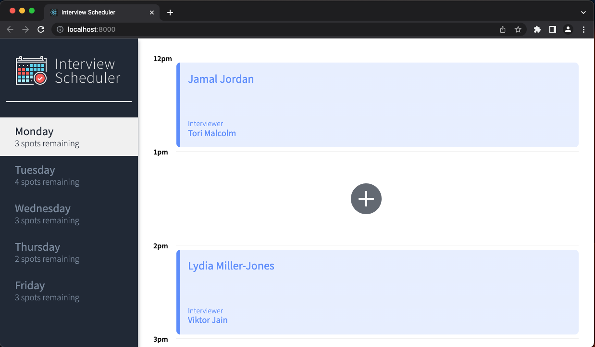
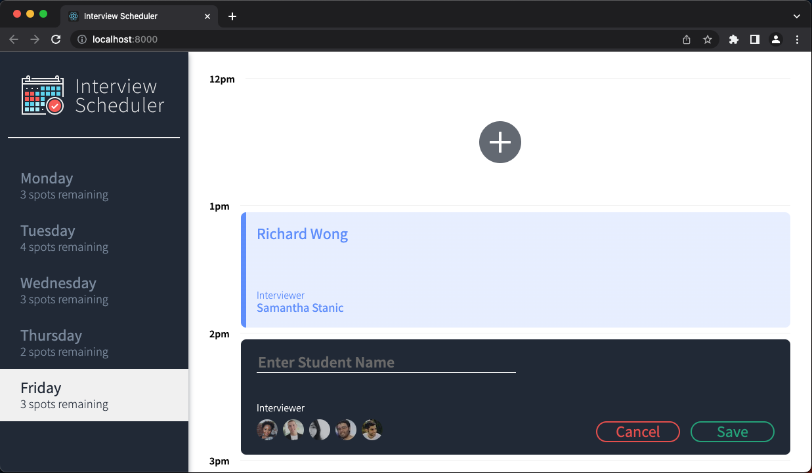
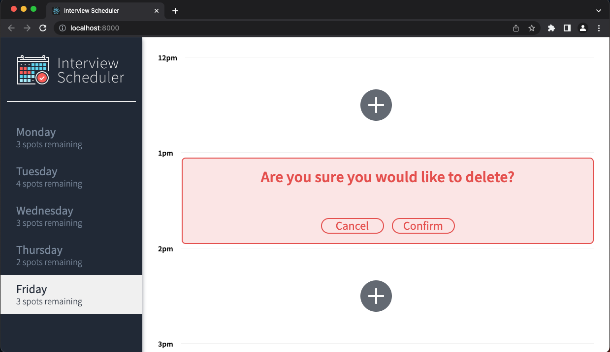

# Interview Scheduler

This application is designed to allow a student to create, edit and delete interview appointments. 

## Final Product
 View of the Home page
 View of the add or edit and interview functionality.  
 View of the delete an interview functionality.  

## Setup

Install dependencies with `npm install`.

## Running Webpack Development Server

```sh
npm start
```

## Running Jest Test Framework

```sh
npm test
```

## Running Storybook Visual Testbed

```sh
npm run storybook
```
